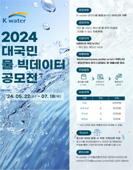

# water
[]

  <h2> <strong>프로젝트 표지</strong> </h2>

 

  <h2><strong>발표자료</strong></h2>

<ul>
  <li>2024 대국민 물 빅데이터 공모전 장려상 (2024.08) 🎉</li>
</ul>

 

  <h2><strong>프로젝트 개요</strong></h2>
  <li>기상 및 수문 데이터를 활용하여 머신러닝 기반의 가뭄 예측 시스템을 개발하였습니다.</li>
  <li>특히, R을 활용한 머신러닝 분석과 Oracle 데이터베이스를 활용한 데이터 관리로 성과를 도출했습니다.</li>
  <li>그 결과, 2024년 K-water 대국민 물 빅데이터 공모전에서 장려상을 수상하였습니다.</li>

<ul>
  <li>2024 대국민 물 빅데이터 공모전 장려상 (2024.08) 🎉</li>
</ul>

 

  <h2>🏅 프로젝트 내용</h2>

<ul>
  <li>2024 대국민 물 빅데이터 공모전 장려상 (2024.08) 🎉</li>
</ul>

 

  <h2>🏅 사용 기술 스택</h2>

<ul>
  <li>2024 대국민 물 빅데이터 공모전 장려상 (2024.08) 🎉</li>
</ul>

 

  <h2>🏅 기대 효과</h2>

<ul>
  <li>2024 대국민 물 빅데이터 공모전 장려상 (2024.08) 🎉</li>
</ul>

 

  <h2>🏅 성과</h2>

<ul>
  <li>2024 대국민 물 빅데이터 공모전 장려상 (2024.08) 🎉</li>
</ul>
